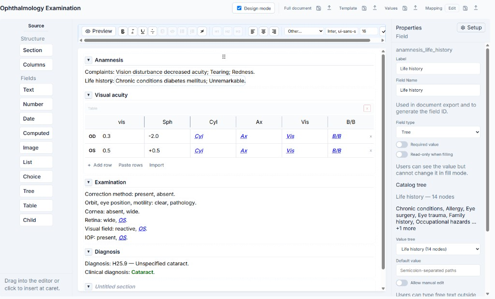
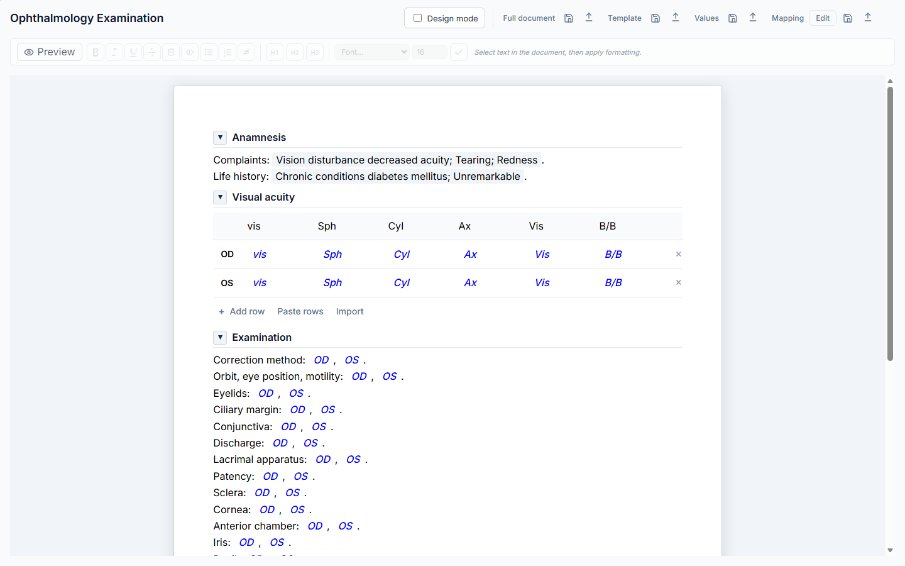
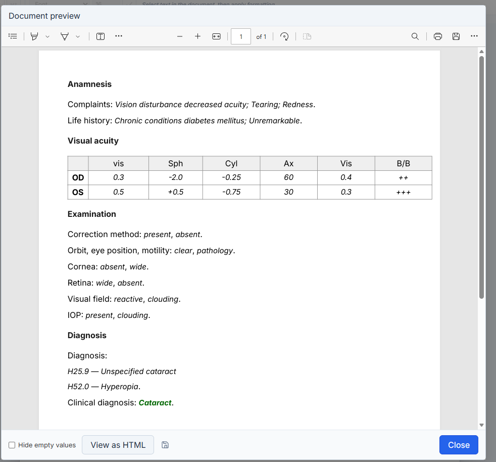
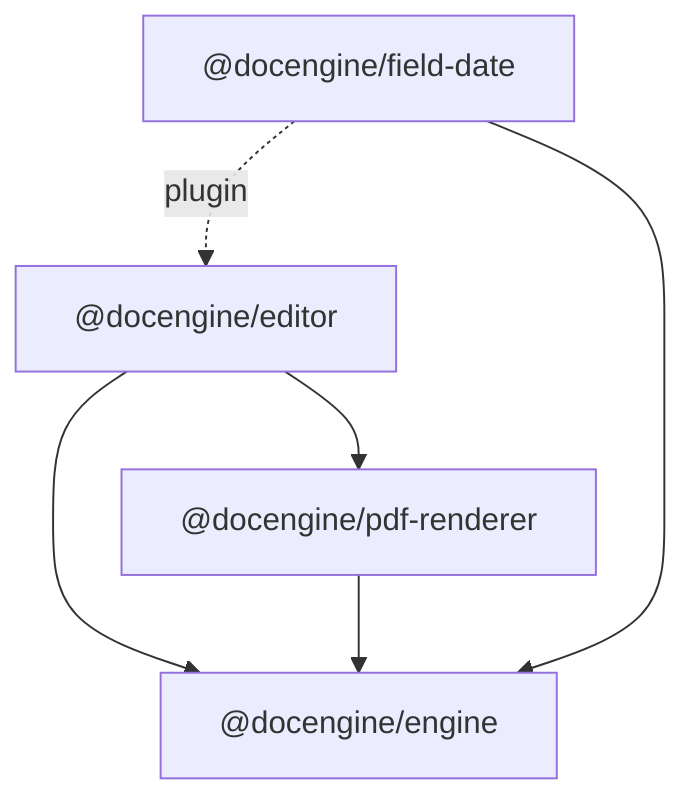
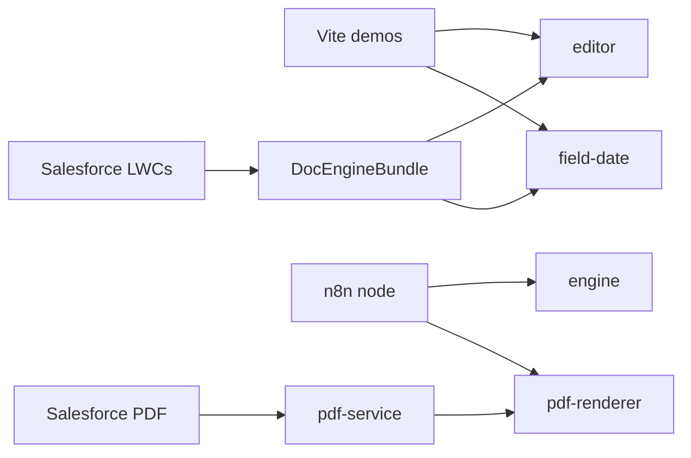

# DocEngine

Document template design, fill, and export — as an embeddable TypeScript library, with demos, a PDF service, an n8n node, and a Salesforce package.

DocEngine lets you design structured document templates (sections, fields, catalogs), fill them with data, and export to JSON, HTML, or PDF. The same core powers browser apps, Salesforce Lightning, and automation workflows.

<p align="center">
  
</p>

## Screenshots

### Design mode

Template editing with a field palette, section layout, and property panel.



### Fill mode

End users complete documents against the template schema.



### Document preview

Read-only preview with optional PDF export from the same document model.



## Features

- **Template editor** — Editor.js-based design mode with inline fields, schema editing, and JSON import/export
- **Headless engine** — field schemas, mapping, formulas, and document I/O without a UI
- **PDF & HTML export** — pdfmake-based rendering for browser and Node
- **Salesforce** — managed-package-ready metadata (templates, filler LWCs, Apex controllers)
- **n8n** — community node to generate HTML/PDF from templates in workflows
- **Themes** — PrimeVue and Salesforce Lightning (SLDS) bridges

## Architecture

`@docengine/engine` is the headless core. UI and export packages sit on top of it; apps host those packages (Salesforce loads a built static resource, not the npm package at runtime).

### Packages



### Hosts



## Repository layout

```text
docEngine/
├── packages/
│   ├── editor/          # @docengine/editor — embeddable template editor
│   ├── engine/          # @docengine/engine — headless document core
│   ├── field-date/      # @docengine/field-date — date field plugin
│   └── pdf-renderer/    # @docengine/pdf-renderer — PDF/HTML export
├── apps/
│   ├── ophthalmology-demo/   # Primary Vite demo
│   ├── primevue-demo/        # PrimeVue-themed demo
│   ├── pdf-service/          # Node PDF HTTP service
│   ├── n8n-nodes-docengine/  # n8n community node
│   └── salesforce/           # Salesforce DX source (DocEngine + DocEngine_PDF)
├── integrations/        # Architecture & packaging notes (SF, LWC)
├── unpackaged/          # Post-install / callout config (not in managed package)
├── examples/            # Sample templates & docs
├── docs/images/         # README screenshots
└── scripts/             # Build helpers (SF bundle, LWC styles)
```

## Packages

| Package | Description |
|---------|-------------|
| [`@docengine/editor`](./packages/editor) | Embeddable template editor (`createEditor`, web component) |
| [`@docengine/engine`](./packages/engine) | Headless I/O, schemas, mapping, formulas |
| [`@docengine/field-date`](./packages/field-date) | Date field handler / modal plugin |
| [`@docengine/pdf-renderer`](./packages/pdf-renderer) | PDF (pdfmake) and HTML export |

Full editor API: [`packages/editor/SPECIFICATIONS.md`](./packages/editor/SPECIFICATIONS.md)

## Quick start

### Prerequisites

- Node.js 20+
- npm (workspaces) — `package-lock.json` is the primary lockfile

### Install

```bash
npm install
```

### Run demos

```bash
# Ophthalmology demo (default)
npm run dev

# PrimeVue demo
npm run dev:primevue

# PDF service
npm run dev:pdf
```

### Build & test

```bash
npm run build:lib      # Library + LWC styles
npm run build          # Lib + ophthalmology demo
npm run build:sf       # Salesforce static resource bundle
npm run typecheck
npm test
```

### Environment

Copy `.env.example` to `.env` if you need image upload configuration:

```bash
# VITE_UPLOAD_BASE_URL=http://localhost:8008
# VITE_IMAGE_UPLOAD_STUB=true
```

## Embed the editor

```js
import { createEditor } from '@docengine/editor';
import '@docengine/editor/styles.css';

const docEngine = createEditor({
  holder: '#editor',
  data: {
    time: Date.now(),
    fieldSchemas: {},
    blocks: [],
  },
  catalogs: {
    lists: { /* commonListId → { items } */ },
    trees: { /* commonTreeId → { tree } */ },
  },
});

await docEngine.ready;
const doc = await docEngine.exportDoc();
```

Optional theme bridges:

```js
import '@docengine/editor/themes/bridge.css';
import '@docengine/editor/themes/prime.css'; // or themes/slds.css
```

## Salesforce

Two SFDX packages:

| Package | Path | Role |
|---------|------|------|
| **DocEngine** | `apps/salesforce/force-app` | Templates, filler, Apex, LWCs |
| **DocEngine_PDF** | `apps/salesforce/force-app-pdf` | Optional Named Credential → `pdf-service` |

Scratch / unmanaged deploy:

```bash
npm run build:sf
sf project deploy start --source-dir apps/salesforce/force-app
sf project deploy start --source-dir unpackaged/post-install
sf org assign permset --name DocEngine_Admin
```

See [`integrations/salesforce/README.md`](./integrations/salesforce/README.md) for architecture, packaging, PDF setup, and security review notes.

## n8n

The [`n8n-nodes-docengine`](./apps/n8n-nodes-docengine) package generates HTML/PDF from DocEngine templates inside n8n workflows (`@docengine/engine` + `@docengine/pdf-renderer`).

## Scripts reference

| Script | Purpose |
|--------|---------|
| `npm run dev` | Ophthalmology demo |
| `npm run dev:primevue` | PrimeVue demo |
| `npm run dev:pdf` | PDF service (watch) |
| `npm run build` | Build lib + demo |
| `npm run build:lib` | Vite library build + LWC styles |
| `npm run build:sf` | Salesforce bundle |
| `npm run typecheck` | TypeScript project references |
| `npm test` | Unit tests across packages |

## Documentation

- [Editor README](./packages/editor/README.md) — install & API overview
- [Editor specifications](./packages/editor/SPECIFICATIONS.md) — data contracts & extension points
- [Salesforce integration](./integrations/salesforce/README.md) — deploy, packaging, PDF, LWS
- [PDF renderer](./packages/pdf-renderer/README.md) — browser vs Node entry points

## License

[MIT](./LICENSE)
